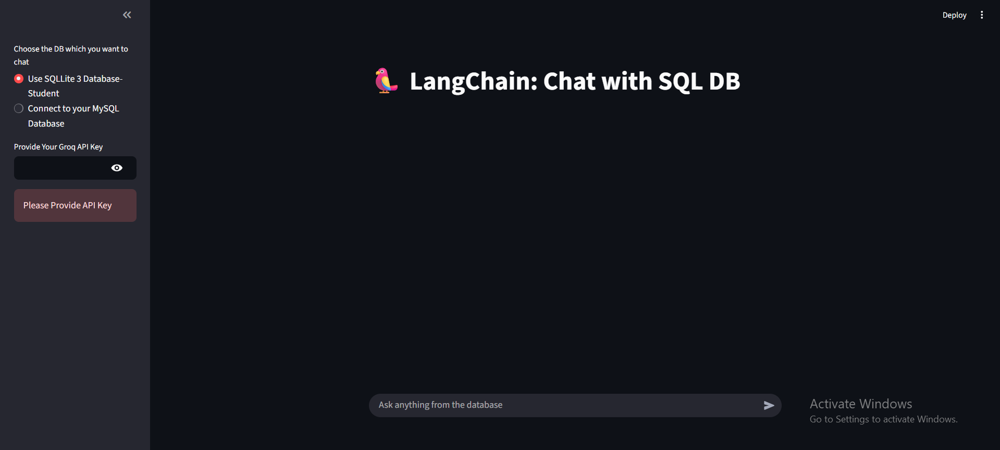

# Chat with SQL DB (Streamlit + LangChain SQL Agent + Groq)

## Overview
A Streamlit app that lets you **chat with a database**: choose a local **SQLite** file (`student.db`) or connect to your own **MySQL** instance. Natural-language questions are translated into SQL by a **LangChain SQL Agent** powered by **Groq** (`llama-3.3-70b-versatile`) and results are shown in the chat. Enter your Groq API key in the sidebar (`gsk_…`) and start querying. :contentReference[oaicite:0]{index=0}

---

## Screenshots

> Put images in a top-level `screenshots/` folder (use simple names like above).

---

## Features
- **Two data sources** from a sidebar toggle:  
  - **SQLite** (bundled `student.db`, opened read-only).  
  - **MySQL** (provide host/user/password/db). :contentReference[oaicite:1]{index=1}
- **Groq LLM**: `llama-3.3-70b-versatile`, `temperature=0`, **streaming** responses. :contentReference[oaicite:2]{index=2}
- **LangChain SQL Agent**: `ZERO_SHOT_REACT_DESCRIPTION` + `SQLDatabaseToolkit` for schema-aware SQL generation. :contentReference[oaicite:3]{index=3}
- **Inline traces** via `StreamlitCallbackHandler` (see tool choices & intermediate steps). :contentReference[oaicite:4]{index=4}
- **Session chat history** + “Clear message history” button. :contentReference[oaicite:5]{index=5}
- **Cached DB setup** (`@st.cache_resource`, TTL 2h) for fast reconnects. :contentReference[oaicite:6]{index=6}

---

## Tools & Technologies
- **Streamlit** (UI, chat input, session state) · **LangChain** (`create_sql_agent`, `SQLDatabase`, `SQLDatabaseToolkit`) · **ChatGroq**  
- **SQLAlchemy** (engines for SQLite/MySQL) · **sqlite3** (read-only file URI) · **python-dotenv** (optional local env) :contentReference[oaicite:7]{index=7}
- **Student sample DB** with `STUDENT(NAME, CLASS, SECTION, MARKS)` (population script included). :contentReference[oaicite:8]{index=8}

---

## How It Works
1. **Select source** in the sidebar: “SQLite – Student” or “MySQL”.  
   - SQLite path is resolved relative to the app and opened **read-only** using a file-URI creator. :contentReference[oaicite:9]{index=9}
2. **Provide Groq API key** (`gsk_…`). The app validates and stops early if the key is missing/invalid. :contentReference[oaicite:10]{index=10}
3. The app builds a **LangChain SQL agent** over the chosen `SQLDatabase` with `ChatGroq`. :contentReference[oaicite:11]{index=11}
4. Type your question (e.g., “Top students in Data Science?”). The agent plans, generates SQL, runs it, and streams the answer + steps. :contentReference[oaicite:12]{index=12}

---

## Configuration
- **API key**: paste `GROQ_API_KEY` in the sidebar (or set env var). The app checks that it starts with `gsk_`. :contentReference[oaicite:13]{index=13}
- **SQLite**: `student.db` is included; schema & seed data come from `sqlite.py`. :contentReference[oaicite:14]{index=14}
- **MySQL**: provide host/user/password/db in the sidebar; the code uses a `mysql+mysqlconnector://…@localhost/<db>` URI (adjust host if needed). :contentReference[oaicite:15]{index=15}
- **Caching**: DB configuration is cached for 2 hours (`@st.cache_resource(ttl="2h")`). :contentReference[oaicite:16]{index=16}

---

## Troubleshooting
- **“Missing or invalid GROQ_API_KEY”** → Ensure the key starts with `gsk_` (paste it in the sidebar). :contentReference[oaicite:17]{index=17}
- **MySQL connect errors** → Verify credentials, driver (`mysql-connector-python`), and host/port; the sample uses `localhost`. :contentReference[oaicite:18]{index=18}
- **SQLite not found** → Confirm `student.db` sits next to `app.py` (the app resolves its absolute path). :contentReference[oaicite:19]{index=19}
- **Agent fails to query** → Check that the `STUDENT` table exists and is populated (use `sqlite.py` once to generate sample data). :contentReference[oaicite:20]{index=20}
- **Slow responses** → Streaming is enabled; big queries or cold starts can add a moment on first run. :contentReference[oaicite:21]{index=21}

---

## License
MIT

